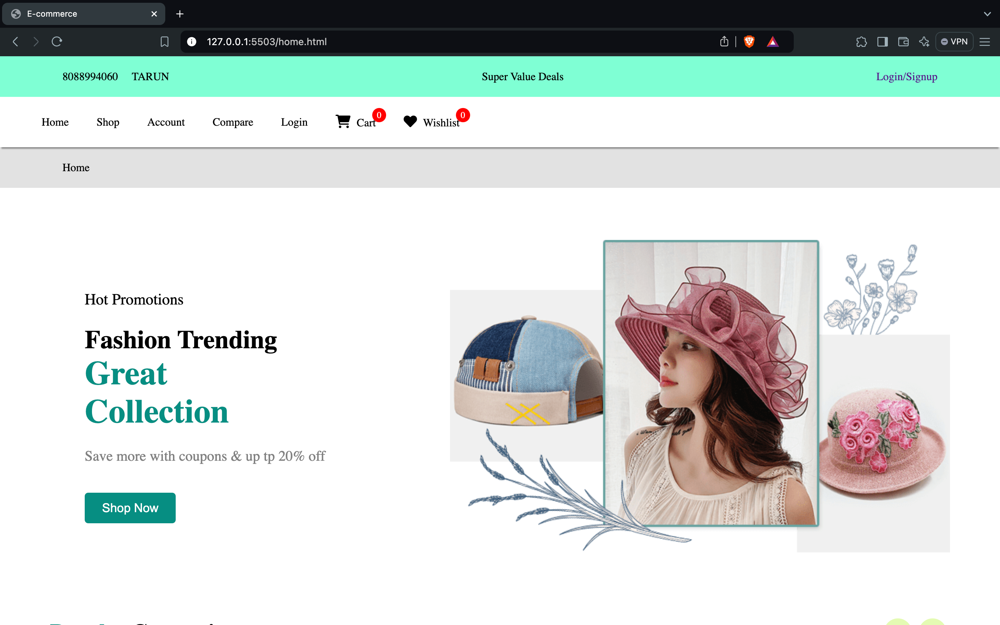
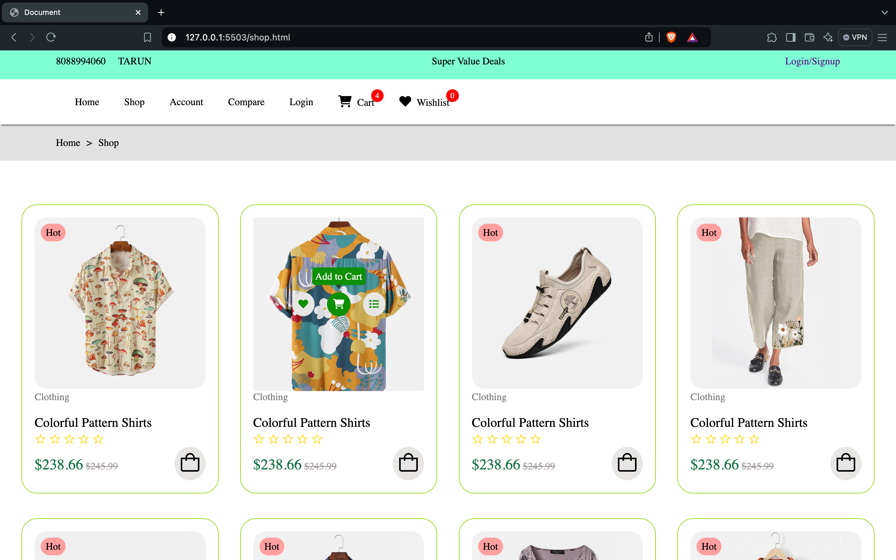
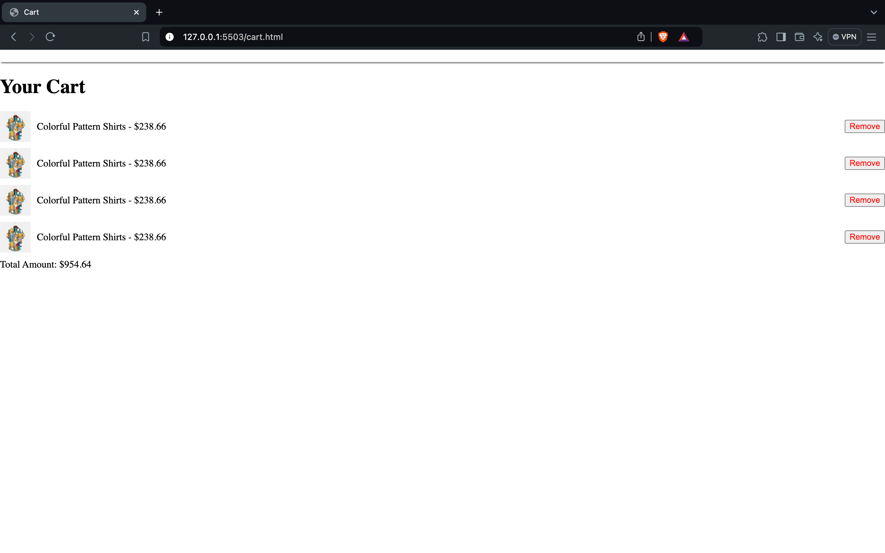

🛍️ Shopping Cart & Wishlist with Local Storage

Welcome to the Shopping Cart & Wishlist project! This simple and stylish web app allows users to add products to their shopping cart and wishlist, utilizing localStorage to persist the data. The app is built using HTML, CSS, and JavaScript, providing an interactive shopping experience. 🚀

🎯 Features

	•	🛒 Add to Cart: Seamlessly add products to your cart, and view the updated cart count in the header.
	•	❤️ Add to Wishlist: Add products to your wishlist, with a redirect to the wishlist page.
	•	🔄 Persistent Data: The cart and wishlist data is saved in your browser’s local storage, ensuring that even if you reload the page, your items remain saved.
	•	💻 Lightweight & Fast: Built using only HTML, CSS, and JavaScript, ensuring quick load times and smooth interactions.

🏗️ Project Structure

📦 Shopping-Cart-Wishlist
 ┣ 📂 assets             # Contains product images and icons
 ┣ 📂 css                # Contains the styling files
 ┃ ┗ 📜 style.css        # Core styles for the project
 ┣ 📂 js                 # Contains the JavaScript files
 ┃ ┗ 📜 script.js        # Core functionality for Cart and Wishlist
 ┣ 📜 index.html         # Main page for the Shopping Cart & Wishlist
 ┣ 📜 wishlist.html      # Wishlist page where added items are displayed
 ┣ 📜 README.md          # This README file

 ⚙️ How to Use

	1.	Clone the Repository:

    git clone https://github.com/TarunKumarReddyK/E-Commerece-Application.git

    2.	Open index.html in your browser:
This will load the main page where you can add items to the cart and wishlist.
	3.	Add Products:
	•	Click the 🛒 “Add to Cart” icon to add a product to your cart.
	•	Click the ❤️ “Add to Wishlist” icon to add a product to your wishlist and be redirected to the wishlist page.
	4.	View Wishlist:
Your added wishlist items will be available in wishlist.html after you are redirected.

🛠️ Tools & Technologies

	•	HTML5: For creating the structure of the pages.
	•	CSS3: For styling and ensuring a user-friendly interface.
	•	JavaScript: To handle the interactive functionality (adding to cart/wishlist, localStorage management).
	•	localStorage: For storing cart and wishlist data persistently.

✨ Custom Features

	•	Tooltip on Hover: Each button shows a helpful tooltip when hovered.
	•	Responsive Design: Adjusts beautifully across all screen sizes, from mobile to desktop. 🖥️ 📱
	•	Star Ratings: Visual representation of product ratings, using Unicode stars.

🚀 Demo

To try out the functionality, follow the instructions and add items to your cart or wishlist.

📸 Screenshots

Here are some visuals from the project:

🤝 Contribution

Feel free to fork the repository, make enhancements, and submit pull requests! Contributions are always welcome. 🎉

💬 Feedback

If you have any suggestions or feedback, feel free to reach out!

Made with ❤️ by TARUN KUMAR REDDY K
